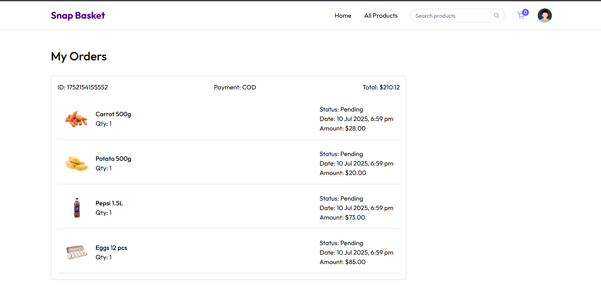

# 🛒 Snap Basket - Client

A modern, responsive grocery e-commerce web application built with React and Vite. Snap Basket offers fresh, organic produce and groceries with a focus on quality and savings.

## 🌟 Home page

## 🌟 All Products page

## 🌟 Product page

## 🌟 Cart page

## 🌟 Orders Placed page



## 🌟 Features

- **Modern UI/UX**: Clean, responsive design optimized for all devices
- **Product Catalog**: Browse through various categories of fresh produce and groceries
- **Search Functionality**: Quick product search with real-time results
- **Shopping Cart**: Add, remove, and manage items in your cart
- **User Authentication**: Secure login and registration system using JWT
- **Product Categories**: Organized product browsing by categories
- **Add Address**: To add address for Delivery ,before placing order
- **Orders Placed**: To check previous order placed

## 🚀 Live Demo

Visit the live application: [https://snap-bucket-client.onrender.com](https://snap-bucket-client.onrender.com)

## 🛠️ Tech Stack

### Frontend
- **React 18** - Modern React with hooks and functional components
- **Vite** - Fast build tool and development server
- **JavaScript/ES6+** - Modern JavaScript features
- **Tailwind** - Custom styling with responsive design
- **React Router** - Client-side routing

### Backend Integration
- **JWT Authentication** - Secure token-based authentication
- **REST API** - Integration with Express.js backend
- **MongoDB** - Database integration for user and product data

## 📦 Installation

### Prerequisites
- Node.js (v16 or higher)
- npm package manager

### Setup

1. **Clone the repository**
   ```bash
   git clone https://github.com/Amanjainji/snap-basket-client.git
   cd snap-basket-client
   ```

2. **Install dependencies**
   ```bash
   npm install
   ```

3. **Environment Variables**
   Create a `.env` file in the root directory:
   ```env
   VITE_API_BASE_URL=your_backend_api_url
   VITE_JWT_SECRET=your_jwt_secret
   ```

4. **Start the development server**
   ```bash
   npm run dev
   ```

5. **Open your browser**
   Navigate to `http://localhost:5173`

## 🏗️ Build for Production

```bash
npm run build
```

The built files will be in the `dist` directory.

## 📁 Project Structure for frontend

```
snap-basket-client/
├── public/
│   ├── index.html
│   └── assets/
├── src/
│   ├── components/
│   │   ├── Header/
│   │   ├── ProductCard/
│   │   ├── Cart/
│   │   └── Auth/
│   ├── pages/
│   │   ├── Home/
│   │   ├── Products/
│   │   ├── Login/
│   │   └── Register/
│   ├── services/
│   │   ├── api.js
│   │   └── auth.js
│   ├── utils/
│   ├── styles/
│   ├── App.jsx
│   └── main.jsx
├── package.json
├── vite.config.js
└── README.md
```

## 🔧 Available Scripts

- `npm run dev` - Start development server
- `npm run build` - Build for production
- `npm run preview` - Preview production build locally
- `npm run lint` - Run ESLint for code quality

## 🌐 API Integration

This client application integrates with a separate Express.js backend API that handles:

- User authentication and authorization
- Product management
- Order processing
- Cart operations
- User profile management

## 📱 Responsive Design

The application is fully responsive and optimized for:
- Desktop computers
- Tablets
- Mobile phones
- Various screen sizes and orientations

## 🔐 Authentication

- JWT-based authentication system
- Secure token storage
- Protected routes for authenticated users
- Login and registration functionality

## 🛍️ Key Pages

- **Home**: Landing page with featured products and categories
- **Products**: Complete product catalog with filtering
- **Cart**: Shopping cart management
- **Login/Register**: User authentication pages
- **Orders**: User can check its orders placed

## 🎨 Design Features

- Clean, modern interface
- Green color scheme representing freshness
- Intuitive navigation
- Product imagery and descriptions
- Call-to-action buttons
- Category-based organization

## 🚀 Deployment

The application is deployed on Render. For your own deployment:

1. Build the project: `npm run build`
2. Deploy the `dist` folder to your hosting service
3. Configure environment variables on your hosting platform

## 🤝 Contributing

1. Fork the repository
2. Create a feature branch: `git checkout -b feature/new-feature`
3. Commit your changes: `git commit -am 'Add new feature'`
4. Push to the branch: `git push origin feature/new-feature`
5. Submit a pull request

## 📞 Support

If you have any questions or need help, please:
- Open an issue on GitHub
- Contact: ajamanjain27@gmail.com

---

⭐ **Star this repository if you found it helpful!**

